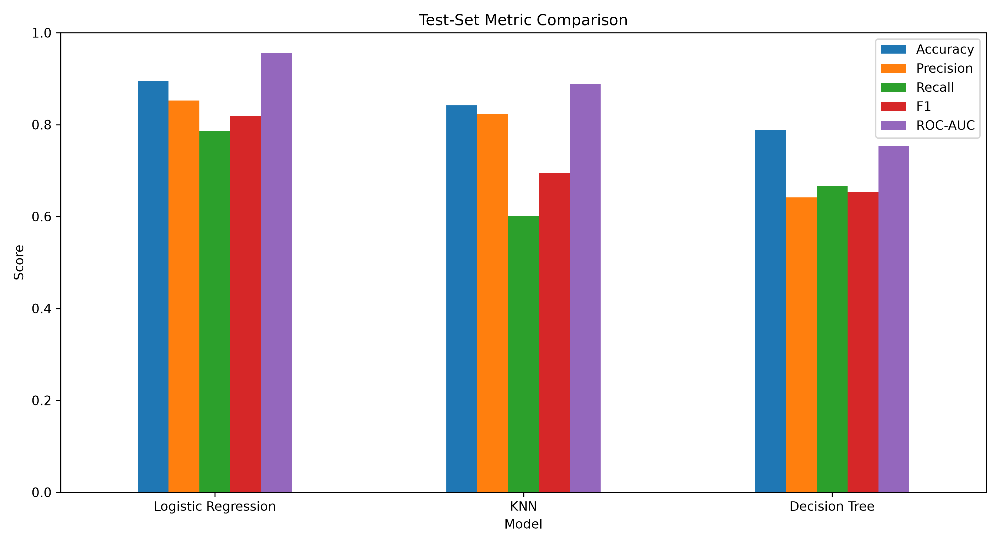
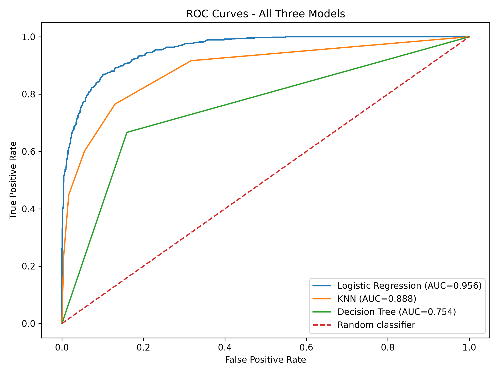
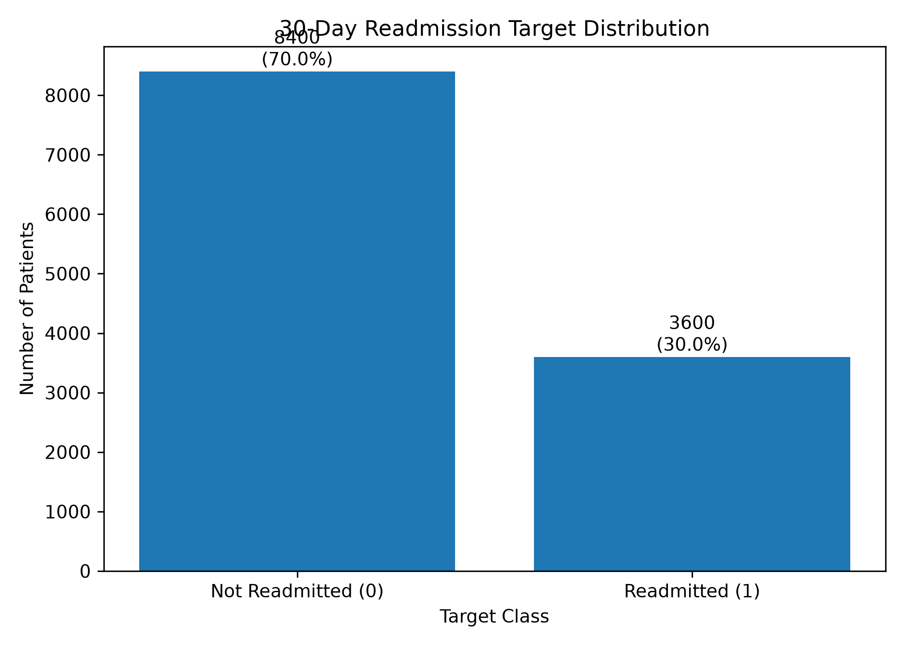
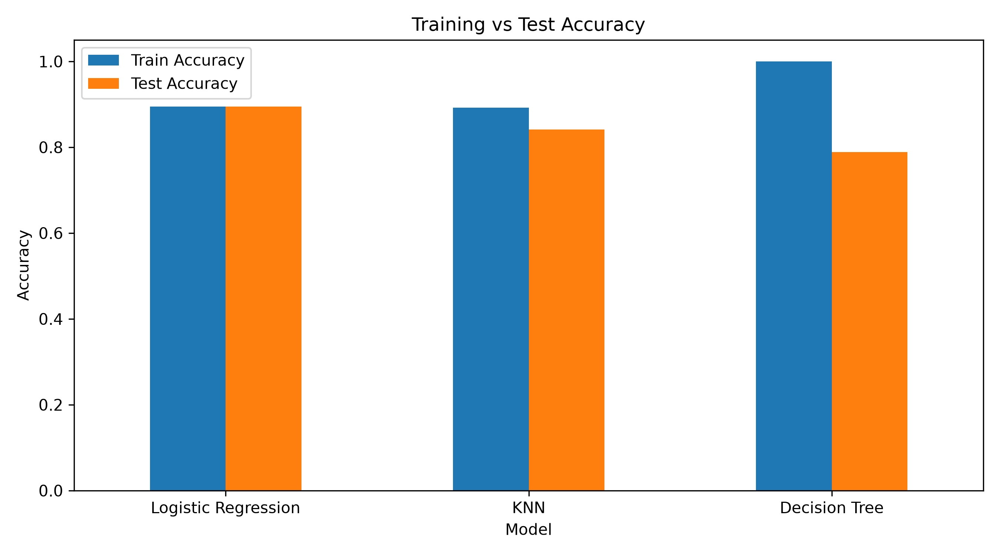
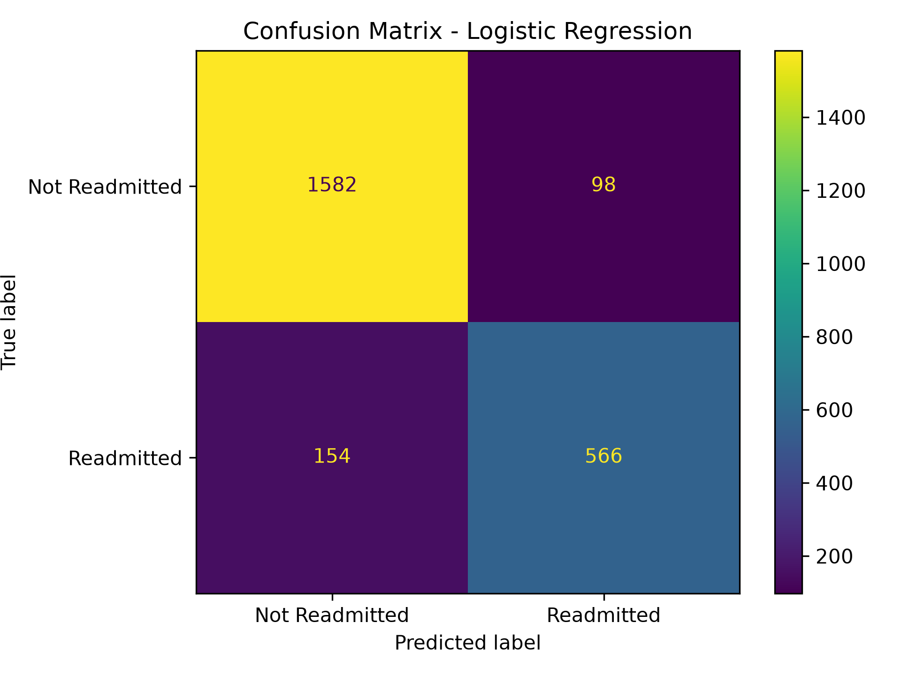
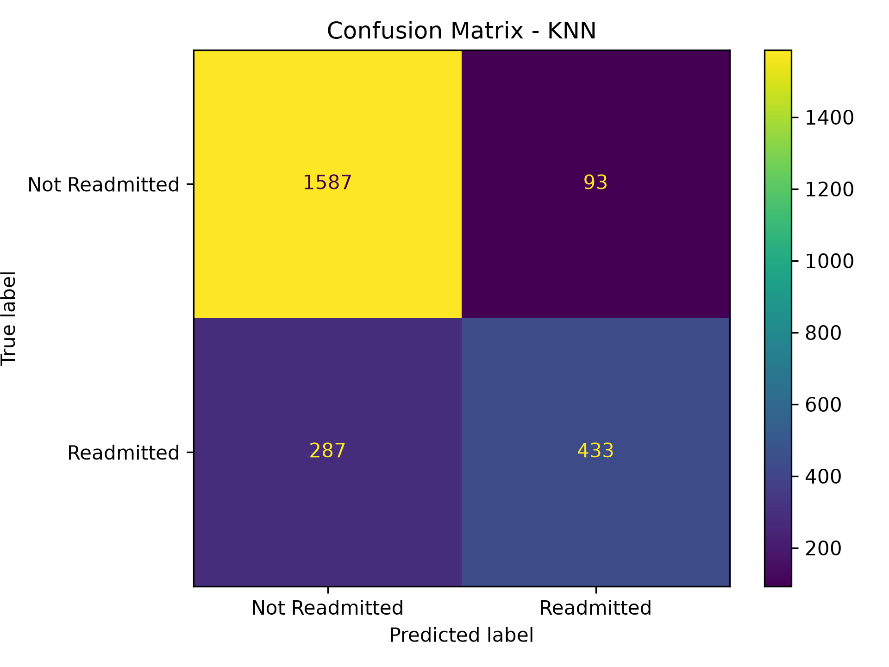

# 🏥 30-Day Hospital Readmission Prediction

A machine learning project that predicts whether a patient will be readmitted to the hospital within 30 days.

## 🎯 Objective

Build a binary classification model using patient and hospital-related data.

**Target:** `Readmitted_30_Days`

## 📊 Dataset

- ~12,000 patient records
- 36 columns
- Binary classification problem

Dataset:

`dataset_12000_records.csv`

## 🛠️ Technologies

- Python
- Pandas
- NumPy
- Scikit-learn
- Matplotlib
- Seaborn
- Joblib

## 🤖 Models

The project evaluates:

- Logistic Regression
- K-Nearest Neighbors (KNN)
- Decision Tree

Experiments include KNN `K` values, Logistic Regression `C` values, and class imbalance analysis.

## 📈 Results

## Model Performance Comparison

| Model | Train Accuracy | Test Accuracy | Test Precision | Test Recall | Test F1 | Test ROC-AUC |
|---|---:|---:|---:|---:|---:|---:|
| Logistic Regression | 0.8946 | 0.8950 | 0.8952 | 0.8950 | 0.8948 | 0.9506 |
| KNN | 0.8924 | 0.8417 | 0.8422 | 0.8417 | 0.8415 | 0.8977 |
| Decision Tree | 1.0000 | 0.7883 | 0.7900 | 0.7883 | 0.7877 | 0.8365 |
### Evaluation Metrics

Accuracy, Precision, Recall, F1-Score, ROC-AUC and Confusion Matrix were used to evaluate model performance.

## 📁 Project Structure

```text
Heart-Failure-30-Day-Readmission-Prediction/
│
├── README.md
├── .gitignore
├── dataset_12000_records.csv
├── hospital_readmission_submission.py
│
└── outputs/
    ├── confusion_matrix_decision_tree.png
    ├── confusion_matrix_knn.png
    ├── confusion_matrix_logistic_regression.png
    ├── data_quality_report.txt
    ├── decision_tree_depth_experiment.csv
    ├── final_summary.txt
    ├── hospital_readmission_model.pkl
    ├── imbalance_comparison.csv
    ├── knn_k_experiment.csv
    ├── logistic_C_experiment.csv
    ├── metric_comparison.png
    ├── model_comparison.csv
    ├── roc_curves_all_models.png
    ├── target_distribution.png
    └── train_vs_test_accuracy.png

## 📊 Visualizations

### 1. Model Metric Comparison



### 2. ROC Curves



### 3. Target Distribution



### 4. Training vs Testing Accuracy



### 5. Logistic Regression Confusion Matrix



### 6. KNN Confusion Matrix



### 7. Decision Tree Confusion Matrix


